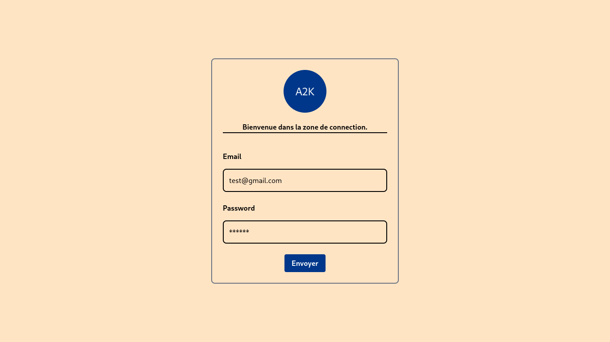

# 💻 Form Using Tailwind CSS

Ce projet est une interface de formulaire moderne et responsive, entièrement conçue avec **Tailwind CSS**.

## ✨ Fonctionnalités

- Formulaire centré à l’écran avec Flexbox
- Champs de saisie pour :
  - Adresse e-mail
  - Mot de passe
- Boutons stylisés avec effets au survol
- Mise en page responsive et esthétique épurée

## 🛠️ Technologies utilisées

- HTML5
- Tailwind CSS v3+
- Flexbox (via les utilitaires Tailwind)

## 📸 Aperçu

 <!-- tu peux modifier ou supprimer cette ligne si pas d'image -->

## 🚀 Utilisation

1. Clone ce dépôt :
   ```bash
   git clone https://github.com/ton-utilisateur/form_using_tailwind_css.git

